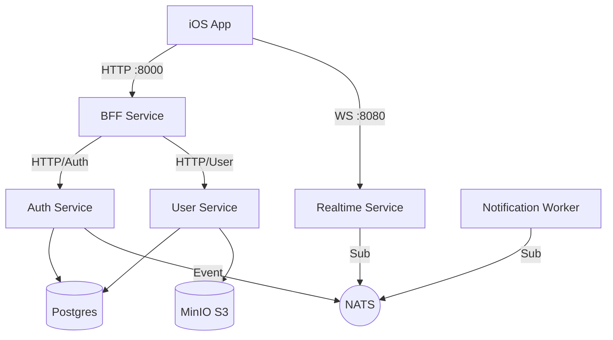

# iOS Backend Monorepo

Welcome to the backend repository for the **iOS SuperApp** project. This project uses a **Microservices** architecture organized as a **Monorepo**.

The system is built with modern technologies for high performance and scalability:

* **Go (Fiber)** — For RESTful services (Auth, User, BFF).
* **Rust (Actix)** — For high-performance Realtime service (WebSocket).
* **PostgreSQL** — Primary relational database.
* **Redis** — Fast caching and session management.
* **NATS** — Message broker for event-driven communication between services.
* **MinIO** — Object storage (S3 compatible) for static files and user avatars.

---

📋 **Table of Contents**

* [System Architecture](#system-architecture)
* [Prerequisites](#prerequisites)
* [Quick Start (Run Locally)](#quick-start-run-locally)
* [Project Structure](#project-structure)
* [Configuration Management (.env)](#configuration-management-env)
* [Development Workflow](#development-workflow)

  * [Database Migrations](#database-migrations)
  * [Adding Dependencies](#adding-dependencies)
  * [MinIO (S3) Setup](#minio-s3-setup)
  * [Hot Reload](#hot-reload)
* [Observability (Monitoring & Tracing)](#observability-monitoring--tracing)
* [Ports List](#ports-list)

---

# System Architecture

This system uses the **BFF (Backend for Frontend)** pattern. The client (iOS App) **ONLY** talks to the `bff-service`, which acts as the main gateway.



**Main services:**

* **bff-service**: Primary gateway. Handles proxying, data aggregation, and rate limiting.
* **auth-service**: Handles registration, login, refresh token, session management, ratings, and chat history.
* **user-service**: Handles user profiles, device tokens, and avatar uploads to S3.
* **realtime-service**: Manages WebSocket connections, realtime chat, and broadcasting events to clients.
* **notification-worker**: Background worker that sends Push Notifications (APNs) based on events from NATS.

---

# Prerequisites

Before starting, make sure the following tools are installed on your machine:

* **Docker & Docker Compose (Required)** — The whole environment runs in containers.
* **Go (Version 1.25+)** — For local development of Go services.
* **Rust (Version 1.79+)** — If you work on the `realtime-service`.
* **Postman / API Client** — For API testing.

---

# Quick Start (Run Locally)

Follow these steps to run the entire system from scratch:

## 1. Clone Repository

```bash
git clone <your-repo-url>
cd ios-backend
```

## 2. Setup Environment Variables

Copy the example `.env.example` to `.env.dev` in each service directory.

```bash
# Auth Service
cp services/auth-service/.env.example services/auth-service/.env.dev

# User Service
cp services/user-service/.env.example services/user-service/.env.dev

# BFF Service
cp services/bff-service/.env.example services/bff-service/.env.dev

# Realtime Service
cp services/realtime-service/.env.example services/realtime-service/.env.dev

# Notification Worker
cp services/notification-worker/.env.example services/notification-worker/.env.dev
```

**IMPORTANT:** Ensure the `INTERNAL_SHARED_SECRET` variable is set to the **same** random string in `auth-service`, `user-service`, and `bff-service` for secure internal communication.

## 3. Start Services with Docker Compose

This command will build images, start containers, and enable hot-reload (Air for Go).

```bash
docker compose -f infra/docker-compose.yml up --build
```

Wait until all services report **"Healthy"** or logs show servers running and connected to NATS/DB.

## 4. Run Database Migrations

Apply the latest DB schema to PostgreSQL:

```bash
docker compose -f infra/docker-compose.yml run --build --rm auth-service-migrate
```

The system is now ready! Access the API through the BFF at: `http://localhost:8000`.

---

# Project Structure

```
ios-backend/
├── infra/                  # Infrastructure configuration (Docker, Prometheus)
│   ├── docker-compose.yml  # Local orchestration
│   └── prometheus/         # Monitoring config
├── services/               # Microservices source code
│   ├── auth-service/       # Go Fiber (Auth, Session, Rating, Chat History)
│   │   ├── cmd/server/     # Entry point
│   │   ├── internal/       # Business logic (API, Service, Repo, Events)
│   │   ├── migrations/     # DB migration files (Goose)
│   │   └── tracing/        # OpenTelemetry setup
│   ├── user-service/       # Go Fiber (Profile & S3 Integration)
│   ├── bff-service/        # Go Fiber (Gateway, Proxy, Aggregation)
│   ├── realtime-service/   # Rust Actix (WebSocket & Chat)
│   └── notification-worker/# Go Worker (NATS Consumer & APNs)
└── README.md
```

---

# Configuration Management (.env)

Each service has its own `.env.dev` file. Key variables to pay attention to:

* **Database:** `DB_HOST`, `DB_PORT`, `DB_USER`, `DB_PASSWORD` (Default: connects to container `ios_postgres`).
* **JWT:** `JWT_SECRET` (Must be the same across `auth-service`, `user-service`, and `realtime-service` for token validation).
* **Internal Security:** `INTERNAL_SHARED_SECRET` (Secret token for inter-service HTTP communication).
* **MinIO (S3):** `S3_ENDPOINT` should be set to `http://localhost:9000` so image URLs are accessible to clients outside Docker. `S3_USE_PATH_STYLE=true` is required for MinIO.

---

# Development Workflow

## Database Migrations

We use **Goose** for DB migrations. Migration files live in `services/auth-service/migrations`.

**To create a new migration:**
Create a new `.go` file in the `migrations` folder with a sequential name (e.g., `00008_add_new_table.go`).

**To run migrations:**

```bash
docker compose -f infra/docker-compose.yml run --build --rm auth-service-migrate
```

## Adding Dependencies

* **Go:** Run `go get <package-name>` in the respective service directory, then run `go mod tidy`. Restart Docker Compose with `--build`.
* **Rust:** Add dependency in `Cargo.toml`, then restart Docker Compose with `--build`.

## MinIO (S3) Setup

To enable avatar upload functionality, do the following on your local MinIO:

1. Open the Console: `http://localhost:9001` (User/Pass: `minioadmin`).
2. Create a new bucket named `avatars`.
3. Set the bucket access policy to `readonly` or `public` so image files can be accessed via URL without authentication.

## Hot Reload

All Go services use **Air**. Save files in your editor (Ctrl+S) and the server inside the container will automatically rebuild and restart.

---

# Observability (Monitoring & Tracing)

The system includes a local monitoring stack:

* **Grafana:** `http://localhost:3000` (Login: `admin/admin`) — Dashboards to visualize metrics from all services.
* **Prometheus:** `http://localhost:9090` — Metrics collector. Each Go and Rust service exposes `/metrics`.
* **Jaeger:** `http://localhost:16686` — Distributed tracing. Use this to trace the lifecycle of a request from BFF → Auth → DB, including latency at each step.

---

# Ports List

| Service          | Port (Host) | Description                    |
| ---------------- | ----------- | ------------------------------ |
| BFF Service      | 8000        | Main API entry point (HTTP)    |
| Auth Service     | 8001        | Internal API (Auth, Session)   |
| User Service     | 8002        | Internal API (Profile)         |
| Realtime Service | 8080        | WebSocket entry point          |
| Postgres         | 5432        | Primary database               |
| Redis            | 6379        | Cache                          |
| NATS             | 4222        | Message Broker / Event Bus     |
| MinIO API        | 9000        | S3 API (Upload/Download files) |
| MinIO Console    | 9001        | Storage admin UI               |
| Grafana          | 3000        | Monitoring dashboard UI        |
| Prometheus       | 9090        | Metrics query UI               |
| Jaeger           | 16686       | Distributed tracing UI         |

---

**Note:** This document was last updated for **Phase 3 (Production Readiness)**. If you encounter issues running the project, check the container logs:

```bash
docker compose logs -f <service_name>
```

or contact the **Tech Lead**.
